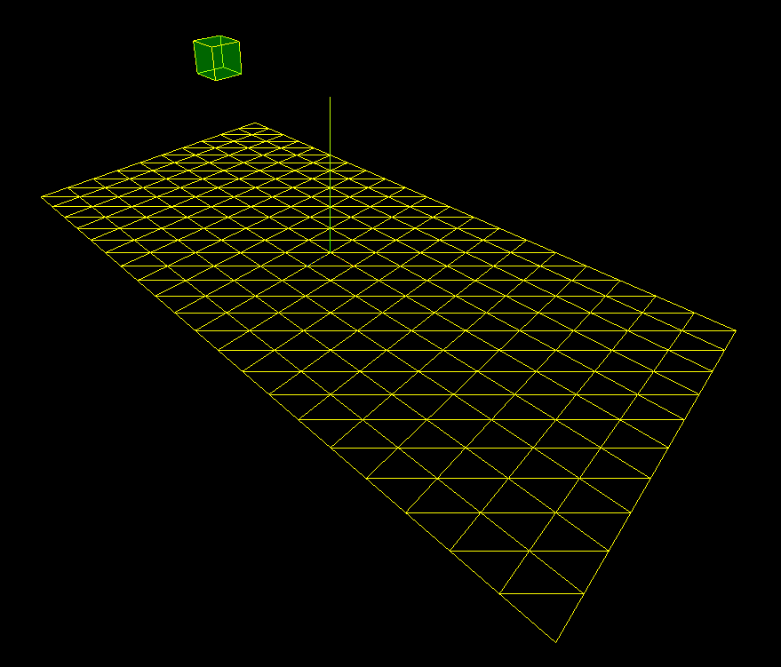

# Locations 3D System

## Overview

The Locations 3D System is a cutting-edge front-end project designed to revolutionize the way we visualize geographical data. At its core, this system allows users to position, track, and follow movements and locations on a three-dimensional map. Leveraging the power of three.js, a renowned JavaScript library for 3D graphics, alongside modern bundling technology with Parcel, the Locations 3D System offers a seamless and dynamic experience for interactive map visualization.

This system is ideal for applications in logistics, gaming, real estate, and urban planning, where accurate and interactive 3D mapping can enhance user experience and decision-making processes.

## Preview

## Collaboration

We believe in the power of collaborative development and invite developers, designers, and GIS enthusiasts to contribute to the Locations 3D System. Whether it's through code contributions, bug reports, feature suggestions, or documentation improvements, every form of collaboration is welcomed. To get involved, please follow our contribution guidelines detailed in our documentation.

## Setup Instructions

To get started with the Locations 3D System, follow these steps:

1. **Install Node.js**: Download and install the latest version of Node.js from [Node.js Official Website](https://nodejs.org/).

2. **Install Parcel**: Parcel is used as a bundler for this project. Install it globally by running `npm install -g parcel-bundler` in your terminal.

3. **Clone the Repository**: Clone the Locations 3D System repository to your local machine using the command `git clone https://github.com/your-repository/locations-3d-system.git`.

4. **Navigate to the Project Directory**: Open a terminal window and navigate to the directory of the cloned repository by executing `cd locations-3d-system`.

5. **Install Dependencies**: Run `npm install` in the project directory to install all the required dependencies.

6. **Start the Development Server**: Execute `parcel index.html` to start the local development server. This command compiles the project and serves it on a local web server.

7. **Open the Application**: Open your web browser and go to `http://localhost:1234` to view the Locations 3D System. The port number may vary, so check the terminal output for the exact URL.

8. **Explore the System**: Interact with the 3D map.

9. **Make Modifications**: Modify the source files as needed. Parcel will automatically rebuild the project when you save your changes.

