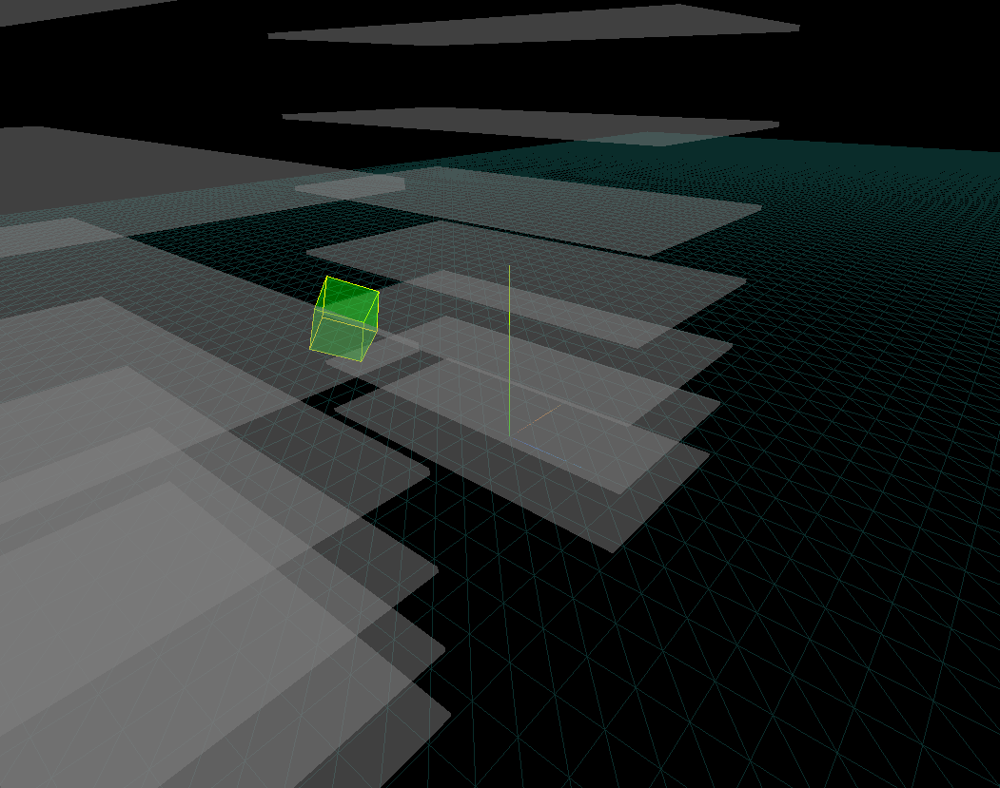

# Locations 3D System

## Overview

The Locations 3D System is a specialized front-end application designed for 3D visualization of spatial data. Utilizing three.js for advanced 3D graphics and Parcel for efficient asset management, this system enables interactive mapping and tracking in three-dimensional space.

## Preview

## Collaboration

Contributions from developers, designers, and specialists in spatial data visualization are welcome. We encourage involvement in the form of code development, bug reporting, feature enhancement, and documentation improvement. For more information on how to contribute, refer to our project documentation.

## Setup Instructions

To get started with the Locations 3D System, follow these steps:

1. **Install Node.js**: Download and install the latest version of Node.js from [Node.js Official Website](https://nodejs.org/).

2. **Install Parcel**: Parcel is used as a bundler for this project. Install it globally by running `npm install -g parcel-bundler` in your terminal.

3. **Clone the Repository**: Clone the Locations 3D System repository to your local machine using the command `git clone https://github.com/your-repository/locations-3d-system.git`.

4. **Navigate to the Project Directory**: Open a terminal window and navigate to the directory of the cloned repository by executing `cd locations-3d-system`.

5. **Install Dependencies**: Run `npm install` in the project directory to install all the required dependencies.

6. **Start the Development Server**: Execute `parcel index.html` to start the local development server. This command compiles the project and serves it on a local web server.

7. **Open the Application**: Open your web browser and go to `http://localhost:1234` to view the Locations 3D System. The port number may vary, so check the terminal output for the exact URL.

8. **Explore the System**: Interact with the 3D map.

9. **Make Modifications**: Modify the source files as needed. Parcel will automatically rebuild the project when you save your changes.

